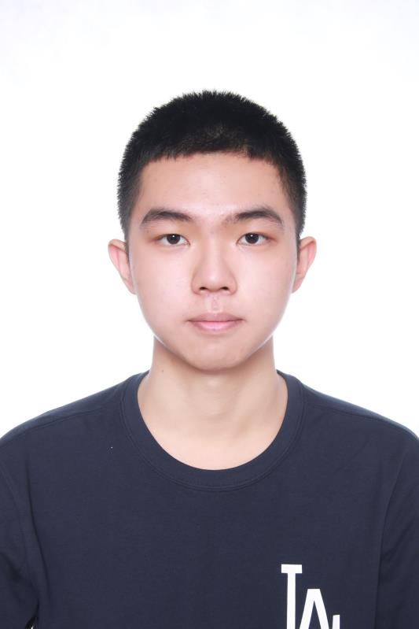

## About Me

Now, I am a M.S student at Shenyang Institute of Automation, University of Chinese Academy of Science. I am a Ph.D. applicant.

## Education Background:
  - M.S. in Computer Science, UCAS,Beijing,China,2023–2026
  - B.E. in Automation, Harbin Engineering University, 2019–2023
## Major Courses
- Introduction to Robot Engineering,
Industrial robot, Analog electronic technology, Digital electronic technology,
Automatic control theory, Automatic control element, Modern control theory,
Microcomputer principle and interface technology, Robot dynamics, Robot
structure design, Robot vision measurement and control, Modern sensor
principle and application
## Research Interests

- **Large Lange Model:** Control Engineering, Code Generation, Image Process
- **Machine Learning:** meta-learning, incremental learning, transfer learning
## Awards and Thesis
- National level:
The First prize of the 16th National College Students Intelligent Car
Competition in 2021 (the 10th place in China)
First Prize of the 17th National College Students Intelligent Car Competition
in 2022 (the 6th place in China)
The first prize of the 11th National College Student Ocean Vehicle Design
Competition in 2022
The third prize of the 13th Beidou Cup National Youth Science and
Technology Innovation Competition in 2022
- State level:
Gold Medal of Heilongjiang Internet + College Students Innovation and
Entrepreneurship Competition in 2021
2021 Silver Award of Heilongjiang Internet + College Students Innovation
and Entrepreneurship Competition (Person in charge)
2022 Gold Award of Heilongjiang Internet + College Students Innovation and
Entrepreneurship Competition (Person in charge)
First Prize of the 16th National College Students' Intelligent Car Competition
in Northeast Division (third prize in Northeast Division)
First prize of the 17th National College Students' Intelligent Car Competition
in Northeast Division (fourth place in Northeast Division) (Person in charge)
First Prize of 2021 National Mathematical Modeling Competition for College
Students (Person in charge)




